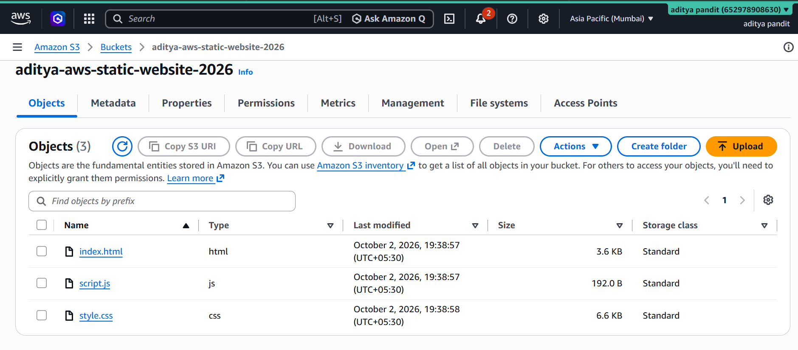
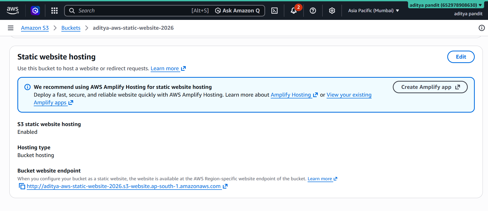
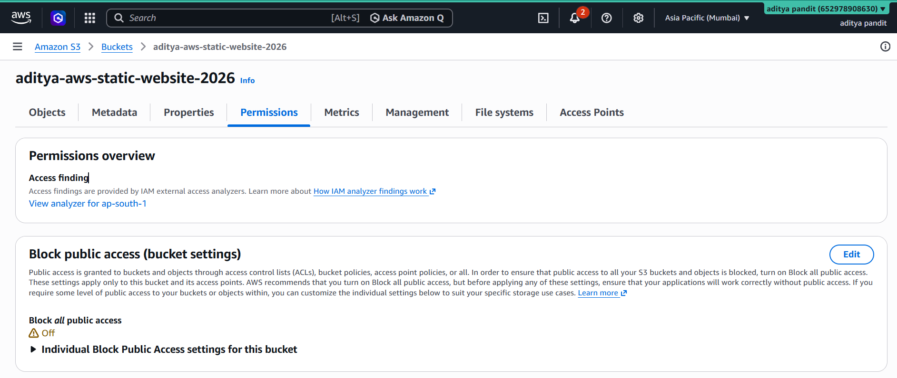
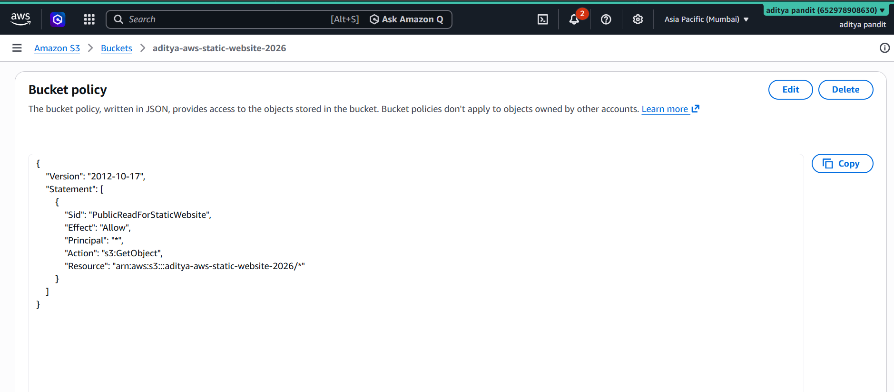
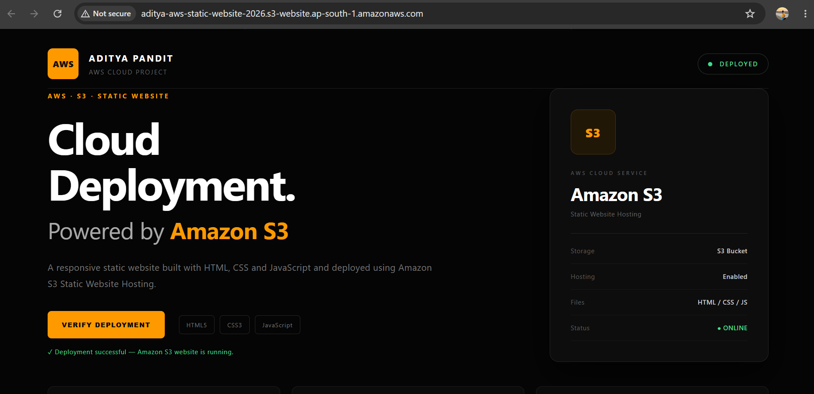

# AWS Q1 – S3 Static Website

## Project Overview

This project demonstrates the deployment of a static website using **Amazon S3 Static Website Hosting**.

The website contains HTML, CSS, and JavaScript files. The files were uploaded to an Amazon S3 bucket, static website hosting was enabled, and the required bucket permissions were configured to make the website publicly accessible.

## AWS Services Used

- Amazon S3
- S3 Static Website Hosting
- S3 Bucket Policy

## Technologies Used

- HTML5
- CSS3
- JavaScript

## Architecture

```text
User
  |
  v
Amazon S3 Bucket
  |
  +-- index.html
  +-- style.css
  +-- script.js
  |
  v
S3 Static Website Endpoint
  |
  v
Web Browser
```

## Implementation

### 1. S3 Bucket Creation

An Amazon S3 bucket was created for hosting the static website.

### 2. Website Files

The following files were created and uploaded to the S3 bucket:

```text
index.html
style.css
script.js
```

### 3. Static Website Hosting

Static Website Hosting was enabled on the S3 bucket.

Configuration:

```text
Index document: index.html
```

### 4. Public Access Configuration

The required S3 public access settings were configured for static website hosting.

A bucket policy was added to allow public read access to the website objects.

Example policy:

```json
{
    "Version": "2012-10-17",
    "Statement": [
        {
            "Sid": "PublicReadForStaticWebsite",
            "Effect": "Allow",
            "Principal": "*",
            "Action": "s3:GetObject",
            "Resource": "arn:aws:s3:::YOUR-BUCKET-NAME/*"
        }
    ]
}
```

`YOUR-BUCKET-NAME` represents the actual S3 bucket name used during deployment.

## Website Features

The website includes:

- Dark-themed single-page interface
- HTML-based page structure
- Custom CSS styling
- JavaScript deployment test
- Responsive layout
- S3 deployment status message

The JavaScript test displays:

```text
✓ Deployment successful — Amazon S3 website is running.
```

when the deployment test button is clicked.

## Testing and Verification

The following tests were performed:

- Verified that all website files were uploaded to S3.
- Verified Static Website Hosting configuration.
- Verified the index document configuration.
- Verified public access configuration.
- Verified the S3 bucket policy.
- Opened the S3 website endpoint in a web browser.
- Tested the website interface.
- Tested the JavaScript deployment button.
- Confirmed the deployment success message was displayed.

## Result

The static website was successfully deployed using **Amazon S3 Static Website Hosting** and accessed through the S3 website endpoint.

## Screenshots

### 1. S3 Bucket Objects



### 2. Static Website Hosting Configuration



### 3. Block Public Access Configuration



### 4. Bucket Policy



### 5. Working Website



## Project Structure

```text
AWS-Q1-S3-Static-Website/
│
├── README.md
├── index.html
├── style.css
├── script.js
└── screenshots/
```

## Security Considerations

- Only the required S3 website objects are exposed for public read access.
- No AWS access keys or secret credentials are stored in the project files.
- The bucket policy is limited to the required S3 object read operation.

## Conclusion

This project demonstrates how Amazon S3 can be used to host and serve a static website without requiring a traditional web server or EC2 instance.

The project successfully demonstrates static website hosting, object management, bucket policy configuration, and browser-based testing using Amazon S3.
